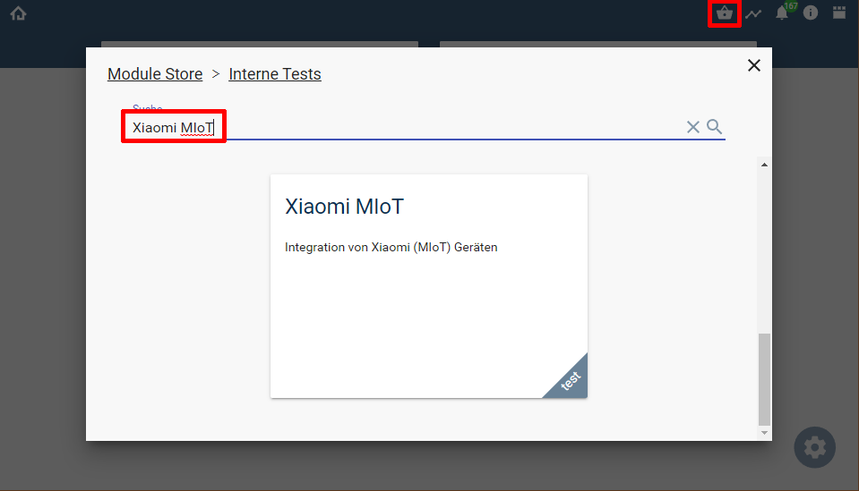
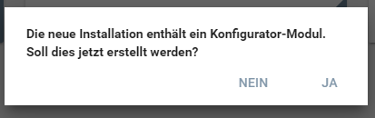
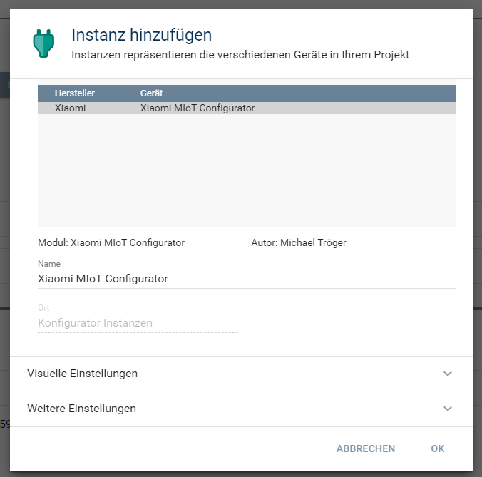
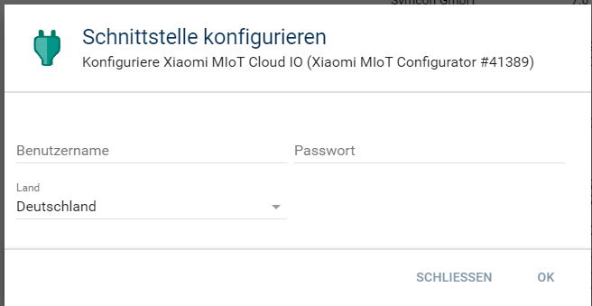
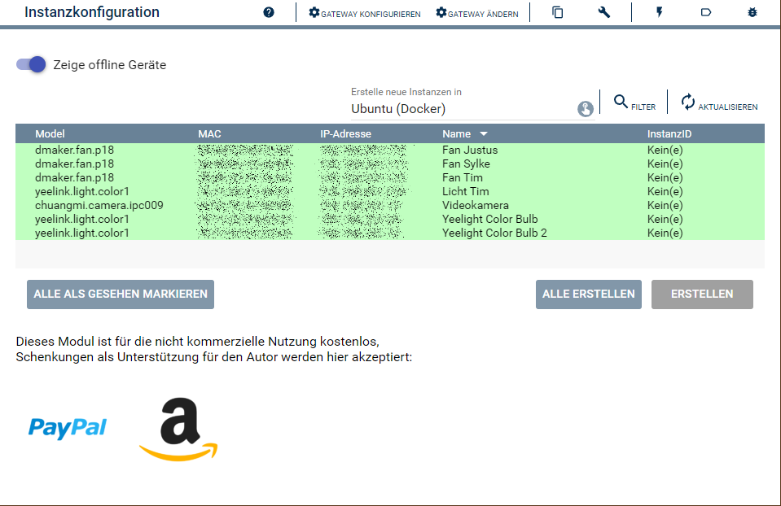

  

   

  

# Xiaomi MIoT <!-- omit in toc -->  

Ermöglicht die Einbindung von Xiaomi Geräten in IP-Symcon.  

## Inhaltsverzeichnis <!-- omit in toc -->

- [1. Vorbemerkungen](#1-vorbemerkungen)
	- [Zur Library](#zur-library)
	- [Zur Integration von Geräten](#zur-integration-von-geräten)
- [2. Voraussetzungen](#2-voraussetzungen)
- [3. Enthaltende Module](#3-enthaltende-module)
- [4. Software-Installation](#4-software-installation)
- [5. Einrichten der Instanzen in IP-Symcon](#5-einrichten-der-instanzen-in-ip-symcon)
- [6. Anhang](#6-anhang)
	- [1. GUID der Module](#1-guid-der-module)
	- [2. Changelog](#2-changelog)
	- [3. Spenden](#3-spenden)
- [7. Lizenz](#7-lizenz)

----------
## 1. Vorbemerkungen

### Zur Library
Diese Library enthält keine Gerätespezifischen Anpassungen für einzelne Gerätemodelle.  
Stattdessen werden alle Fähigkeiten und Eigenschaften von Geräten einmalig aus der Xiaomi Cloud geladen.  
Entsprechend können grundsätzlich alle Geräte, auch von Drittherstellern, eingebunden werden, sofern das Gerät in der `Mi Home App` vorhanden und angelernt ist.  

Die Kommunikation der Geräte kann sowohl lokal (LAN/WLAN) als auch über die Cloud erfolgen.  
**Jedoch unterstützt nicht jedes Gerät die lokale Kommunikation.**

----------
### Zur Integration von Geräten  

Es werden Instanzen zur Kommunikation mit der Cloud (Cloud IO), einrichten von Geräten in Symcon (Konfigurator) und die eigentlichen Geräte Instanzen bereitgestellt.  

Für die Ersteinrichtung ist zwingend ein Internetzugang, sowie die Zugangsdaten des Account der Mi Cloud (Mi Account bzw. Konto der Mi Home App) nötig.  

## 2. Voraussetzungen

 - IPS 6.4 oder höher
 - Eingebundene Geräte in der Mi Home App

## 3. Enthaltende Module

Folgende Module beinhaltet das Xiaomi MIoT Repository:

- __Xiaomi MIoT Cloud IO__ ([Dokumentation](Xiaomi%20MIoT%20Cloud%20IO/README.md))  
	IO Instanz zur Kommunikation mit der Cloud.  

- __Xiaomi MIoT Configurator__ ([Dokumentation](Xiaomi%20MIoT%20Configurator/README.md))  
	Konfigurator welche alle in der Cloud vorhandenen Geräte anzeigt und zum erstellen von Geräte Instanzen verwendet wird.

- __Xiaomi MIoT Device__ ([Dokumentation](Xiaomi%20MIoT%20Device/README.md))  
	Geräte Instanz, welche die jeweils ein Gerät in Symcon abbildet.

## 4. Software-Installation

  Über den `Module-Store` in IPS das Modul `Xiaomi MIot` hinzufügen.  
   **Bei kommerzieller Nutzung (z.B. als Errichter oder Integrator) wenden Sie sich bitte an den Autor.**  
  

## 5. Einrichten der Instanzen in IP-Symcon

Details sind direkt in der Dokumentation der jeweiligen Module beschrieben.  
Es wird empfohlen die Einrichtung mit der Konfigurator-Instanz zu starten [Xiaomi MIoT Configurator](Xiaomi%20MIoT%20Configurator/README.md).  
Nach der installation aus dem Store wird diese Instanz auf Rückfrage automatisch angelegt.
  
  
 Dabei wird die Konfiguration bis zur [Xiaomi MIoT Cloud IO](Xiaomi%20MIoT%20Cloud%20IO/README.md) durchlaufen.  
  
Sind die Eingaben korrekt, so wird der [Xiaomi MIoT Configurator](Xiaomi%20MIoT%20Configurator/README.md) geöffnet.
  

## 6. Anhang

###  1. GUID der Module
 
 
| Modul                    | Typ          | Prefix | GUID                                   |
| ------------------------ | ------------ | ------ | -------------------------------------- |
| Xiaomi MIoT Cloud IO     | IO           | XIAOMI | {DF2248D9-FC17-4609-840D-BA52DBF9CEB6} |
| Xiaomi MIoT Configurator | Configurator | XIAOMI | {CCB7419D-F038-E519-8D63-171260FED0A0} |
| Xiaomi MIoT Device       | Device       | XIAOMI | {733AB5D2-957D-E76A-BA5D-5006701A6216} |

### 2. Changelog

  Version 1.05:  
 - Übersetzungen von Tagen, Stunden, Minuten, Sekunden fehlte  
 - Fehlende Übersetzungen der Systemsprache werden aus der englischen Übersetzung des Gerätes ergänzt  
 - Cloud IO zeigt den Benutzernamen in der Info Spalte an, damit mehrere Instanzen besser unterschieden werden können  
 - Konfigurator  berücksichtigt nur Instanzen welche am selben IO hängen (oder bei Roborock-Instanzen welche den gleichen Cloud Usernamen haben)  
 - Geräte Instanz zeigt das Modul in der Info Spalte an     

  Version 1.01:  
 - Start der offenen Beta  

### 3. Spenden  
  
  Die Library ist für die nicht kommerzielle Nutzung kostenlos, Schenkungen als Unterstützung für den Autor werden hier akzeptiert:  

## 7. Lizenz

  IPS-Modul:  
  [CC BY-NC-SA 4.0](https://creativecommons.org/licenses/by-nc-sa/4.0/)  