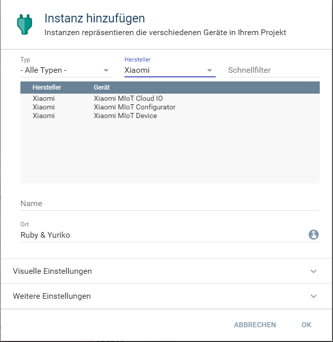

  

   

  

# Xiaomi MIoT Cloud IO <!-- omit in toc -->  

## Inhaltsverzeichnis <!-- omit in toc -->  

- [1. Funktionsumfang](#1-funktionsumfang)
- [2. Voraussetzungen](#2-voraussetzungen)
- [3. Software-Installation](#3-software-installation)
- [4. Einrichten der Instanzen in IP-Symcon](#4-einrichten-der-instanzen-in-ip-symcon)
- [5. Statusvariablen und Profile](#5-statusvariablen-und-profile)
- [6. WebFront](#6-webfront)
- [7. PHP-Befehlsreferenz](#7-php-befehlsreferenz)
- [8. Aktionen](#8-aktionen)
- [9. Anhang](#9-anhang)
  - [1. Changelog](#1-changelog)
  - [2. Spenden](#2-spenden)
- [10. Lizenz](#10-lizenz)

## 1. Funktionsumfang

* Instanz für die Kommunikation mit der MIoT Cloud.  

## 2. Voraussetzungen

 - IPS 6.4 oder höher
 - Eingebundene Geräte in der Mi Home App

## 3. Software-Installation

* Dieses Modul ist Bestandteil der [Xiaomi MIoT-Library](../README.md#4-software-installation).  

## 4. Einrichten der Instanzen in IP-Symcon

 Unter `Instanz hinzufügen` ist das `Xiaomi MIoT Cloud IO`-Modul unter dem Hersteller `Xiaomi` aufgeführt.  
  

 Diese Instanz wird automatisch mit erzeugt, wenn eine neue Instanz vom [MIoT Configurator-Modul](../Xiaomi%20MIoT%20Configurator/README.md) angelegt wird.  

  

### Konfigurationsseite <!-- omit in toc -->  

| Name     | Text         | Beschreibung                                                  |
| -------- | ------------ | ------------------------------------------------------------- |
| Username | Benutzername | eMail-Adresse, MI Konto-ID oder Rufnummer (inkl. Länderkennung) |
| Password | Passwort     | Passwort des Account                                          |
| Country  | Land         | Auswahl welche Cloud benutzt werden soll                      |

Da es diverse Geräte gibt, welche keine direkte Kommunikation im lokalen Netzwerk erlauben, versucht die `Xiaomi MIoT Geräte`-Instanz das Gerät dann über die Cloud anzusprechen.  
Dazu muss zwingend eine `Xiaomi MIoT Cloud IO`-Instanz als Gateway verbunden sein.  

## 5. Statusvariablen und Profile

Dieses Modul erstellt keine Statusvariablen und Profile.  

## 6. WebFront

Dieses Modul ist nicht für die Visualisierung geeignet.

## 7. PHP-Befehlsreferenz

Dieses Modul stellt keine Instanz-Funktionen bereit.

## 8. Aktionen

Es gibt keine speziellen Aktionen für dieses Modul.  

## 9. Anhang

### 1. Changelog

[Changelog der Library](../README.md#2-changelog)

### 2. Spenden

  Die Library ist für die nicht kommerzielle Nutzung kostenlos, Schenkungen als Unterstützung für den Autor werden hier akzeptiert:  

 

## 10. Lizenz

  IPS-Modul:  
  [CC BY-NC-SA 4.0](https://creativecommons.org/licenses/by-nc-sa/4.0/)  
