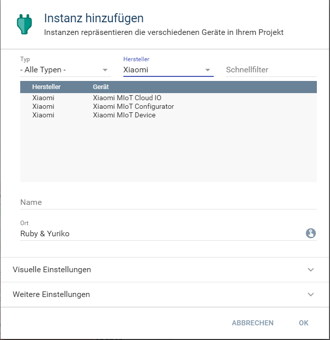
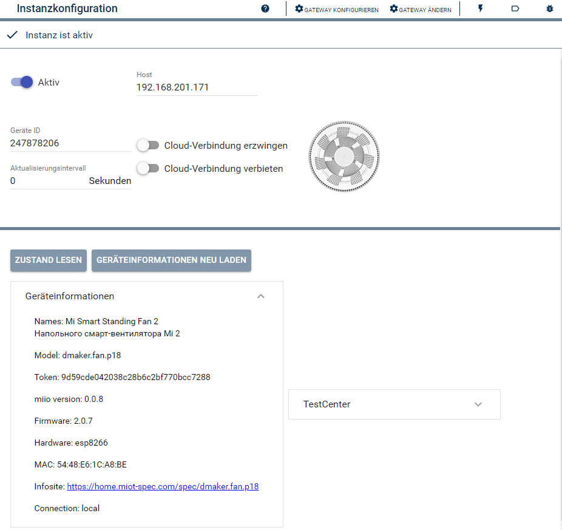

  

   

  

# Xiaomi MIoT Device <!-- omit in toc -->  

## Inhaltsverzeichnis <!-- omit in toc -->  

- [1. Funktionsumfang](#1-funktionsumfang)
- [2. Voraussetzungen](#2-voraussetzungen)
- [3. Software-Installation](#3-software-installation)
- [4. Einrichten der Instanzen in IP-Symcon](#4-einrichten-der-instanzen-in-ip-symcon)
- [5. Statusvariablen und Profile](#5-statusvariablen-und-profile)
  - [Statusvariablen](#statusvariablen)
  - [Profile](#profile)
- [6. WebFront](#6-webfront)
- [7. PHP-Befehlsreferenz](#7-php-befehlsreferenz)

## 1. Funktionsumfang

* Instanz für die Integration eines Xiaomi Gerätes in von Symcon.  

## 2. Voraussetzungen

 - IPS 6.4 oder höher
 - Eingebundene Geräte in der Mi Home App

## 3. Software-Installation

* Dieses Modul ist Bestandteil der [Xiaomi MIoT-Library](../README.md#4-software-installation).  

## 4. Einrichten der Instanzen in IP-Symcon

 Unter 'Instanz hinzufügen' ist das 'Xiaomi MIoT Device'-Modul unter dem Hersteller `Xiaomi` aufgeführt.  
  

 Es wird empfohlen diese Instanz über die dazugehörige Instanz des [MIoT Configurator-Moduls](../Xiaomi%20MIoT%20Configurator/README.md) von diesem Geräte anzulegen.  

__Konfigurationsseite__:

  

| Name | Beschreibung |
| ---- | ------------ |
|      |
|      |

## 5. Statusvariablen und Profile

Die Statusvariablen/Kategorien werden automatisch angelegt. Das Löschen einzelner kann zu Fehlfunktionen führen.

### Statusvariablen

| Name            | Typ     | Beschreibung                              |
| --------------- | ------- | ----------------------------------------- |
| Open            | boolean | Verbindung aktiv                          |
| Host            | string  | IP-Adresse von dem Gerät                  |
| DeviceId        | string  | Geräte ID zur eindeutigen Identifizierung |
| ForceCloud      | boolean | Cloud Anbindung erzwingen                 |
| DeniedCloud     | boolean | Cloud Anbindung verbieten                 |
| RefreshInterval | integer | Intervall der Statusaktualisierung        |

### Profile

Profile werden auf Basis der Gerätefähigkeiten erzeugt.

## 6. WebFront

Die direkte Darstellung des Medien-Objektes und der eventuellen Statusvariablen von Ereignissen ist möglich; es wird aber empfohlen mit Links zu arbeiten.  

## 7. PHP-Befehlsreferenz

`boolean XIAOMI_BeispielFunktion(integer $InstanzID);`
Erklärung der Funktion.

Beispiel:
`XIAOMI_BeispielFunktion(12345);`