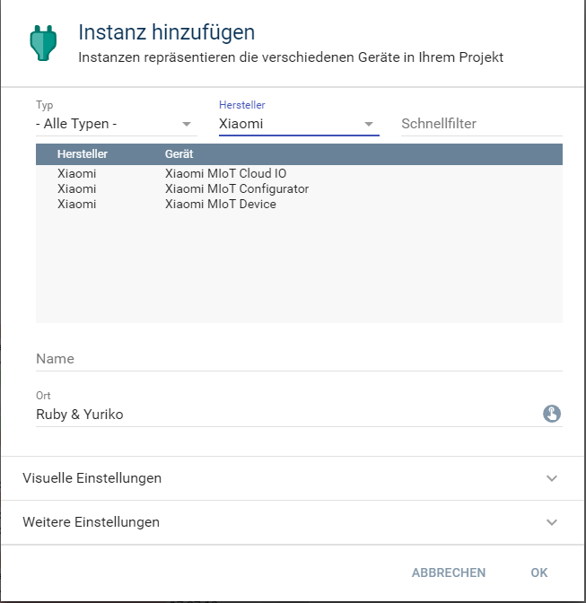
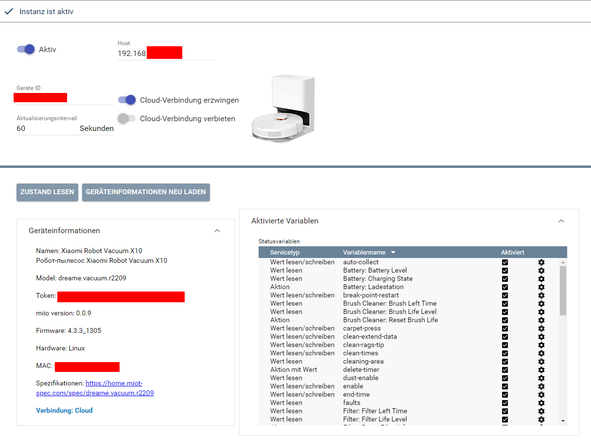
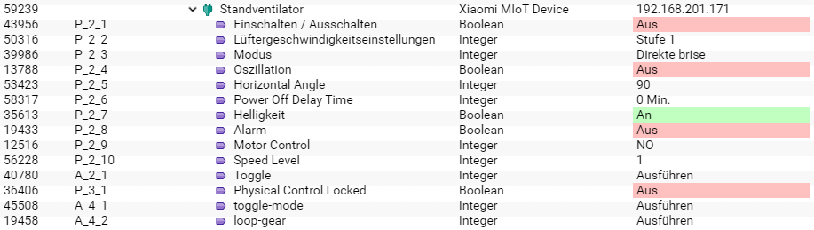

[](https://www.symcon.de/service/dokumentation/entwicklerbereich/sdk-tools/sdk-php/)
[]()
[](https://www.symcon.de/de/service/dokumentation/installation/migrationen/v63-v64-q2-2023/)  
[](https://creativecommons.org/licenses/by-nc-sa/4.0/)
[](https://github.com/Nall-chan/Xiaomi/actions) [](https://github.com/Nall-chan/Xiaomi/actions)  
[](#2-spenden)
[](#2-spenden)  

# Xiaomi MIoT Device <!-- omit in toc -->  

## Inhaltsverzeichnis <!-- omit in toc -->  

- [1. Funktionsumfang](#1-funktionsumfang)
- [2. Voraussetzungen](#2-voraussetzungen)
- [3. Software-Installation](#3-software-installation)
- [4. Einrichten der Instanzen in IP-Symcon](#4-einrichten-der-instanzen-in-ip-symcon)
  - [Konfigurationsseite (Parameter)](#konfigurationsseite-parameter)
  - [Konfigurationsseite (Status und Bedienung)](#konfigurationsseite-status-und-bedienung)
- [5. Statusvariablen und Profile](#5-statusvariablen-und-profile)
  - [Statusvariablen](#statusvariablen)
  - [Profile](#profile)
- [6. WebFront](#6-webfront)
- [7. PHP-Befehlsreferenz](#7-php-befehlsreferenz)
  - [Zustandsabfrage](#zustandsabfrage)
  - [Schreiben von Werten](#schreiben-von-werten)
  - [Ausführen einer Aktion](#ausführen-einer-aktion)
- [8. Aktionen](#8-aktionen)
- [9. Anhang](#9-anhang)
  - [1. Changelog](#1-changelog)
  - [2. Spenden](#2-spenden)
- [10. Lizenz](#10-lizenz)

## 1. Funktionsumfang

* Instanz für die Integration eines Xiaomi Gerätes in von Symcon.  

## 2. Voraussetzungen

 - IPS 6.4 oder höher
 - Eingebundene Geräte in der Mi Home App

## 3. Software-Installation

* Dieses Modul ist Bestandteil der [Xiaomi MIoT-Library](../README.md#4-software-installation).  

## 4. Einrichten der Instanzen in IP-Symcon

 Unter `Instanz hinzufügen` ist das `Xiaomi MIoT Device`-Modul unter dem Hersteller `Xiaomi` aufgeführt.  
  

 Es wird empfohlen diese Instanz über die dazugehörige Instanz des [MIoT Configurator-Moduls](../Xiaomi%20MIoT%20Configurator/README.md) von diesem Geräte anzulegen.  

  

### Konfigurationsseite (Parameter)  

| Name            | Text                       | Beschreibung                                                               |
| --------------- | -------------------------- | -------------------------------------------------------------------------- |
| Open            | Aktiv                      | Verbindung aktiv                                                           |
| Host            | Host                       | IP-Adresse von dem Gerät                                                   |
| DeviceId        | Geräte-ID                  | Geräte ID zur eindeutigen Identifizierung                                  |
| RefreshInterval | Aktualisierungsintervall   | Intervall der Statusaktualisierung                                         |
| ForceCloud      | Cloud-Verbindung erzwingen | Das Gerät ausschließlich über die Cloud ansprechen                         |
| DeniedCloud     | Cloud-Verbindung verbieten | Auch im Fehlerfall niemals versuchen das Gerät über die Cloud zu erreichen |


Da es diverse Geräte gibt, welche keine direkte Kommunikation im lokalen Netzwerk erlauben, versucht die Geräte-Instanz das Gerät dann über die Cloud anzusprechen.  

Dieses Verhalten **kann** durch die beiden Einstellungen `Cloud-Verbindung erzwingen` bzw. `Cloud-Verbindung verbieten` verändert werden.  
Es darf nur einer der beiden Einstellungen aktiv sein.  
Bei `erzwingen` wird (nach dem Handshake mit dem Gerät, was immer lokal läuft) die gesamte weitere Kommunikation über die Cloud geführt.  
Bei `verbieten` wird niemals automatisch auf die Cloud Verbindung umgeschaltet, wenn das Gerät auf lokale Anfragen nicht reagiert.  

**Im Normalfall brauchen diese Einstellungen nicht verändert werden!**

### Konfigurationsseite (Status und Bedienung)  

Über die Schaltfläche `Zustand lesen` kann eine manuelle Statusaktualisierung erfolgen.  
Die Schaltfläche `Geräteinformationen neu laden` bewirkt das löschen alle abgespeicherten Fähigkeiten und neu laden derselben aus der Cloud. Anschließend werden u.U. die Statusvariablen und Profile um neue Eigenschaften ergänzt.  

Der Bereich `Geräteinformationen` zeigt alle erkannten Eigenschaften von dem Gerät an.  
Besonders hervorzuheben ist der Punkt `Model`, da eine Änderung vom Model ein automatisches neu laden der Geräteinformationen auslöst.  
Der Link unter `Spezifikationen` führt zu den MIoT Spezifikationen des Gerätes.  

## 5. Statusvariablen und Profile

### Statusvariablen

Die Statusvariablen inklusive der Übersetzung werden automatisch auf Basis der Gerätefähigkeiten erzeugt.  

Bei fehlenden Übersetzungen in der Cloud, findet keine passende Lokalisierung statt, die Variablen sollten dann selbst umbenannt werden.

__Beispiel von einem Standlüfter:__

  

**Ident der Variablen:**  
Der Erste Buchstabe eines Ident einer Statusvariable gibt Auskunft darüber ob es sich um eine Eigenschaft/Wert vom Gerät (P) oder eine ausführbare Aktion (A) handelt.  
Während Eigenschaften/Werte den jeweiligen Zustand darstellen und auch abgefragt werden können, so sind Aktion nicht lesbar und können entsprechen keinen Zustand annehmen und darstellen.  

### Profile

Die Profile inklusive der Übersetzungen, Maßeinheiten usw. werden automatisch auf Basis der Gerätefähigkeiten erzeugt.
Statusvariablen welche Aktionen abbilden und keine Parameter erwarten, erhalten einheitlich das Profil `XIAOMI.Execute` mit der einzigen Assoziation `Ausführen`.  

## 6. WebFront

Die direkte Darstellung im WebFront ist möglich; es wird aber empfohlen mit Links zu arbeiten.  

## 7. PHP-Befehlsreferenz

### Zustandsabfrage  

```php
boolean XIAOMI_RequestState(integer $InstanzID);
```
Erklärung der Funktion.

Beispiel:
```php
XIAOMI_RequestState(12345);
```
---
### Schreiben von Werten  

**Es wird empfohlen Schaltaktionen mit dem universellen Befehl [`RequestAction(integer $VariableID, mixed $Value);` (Link zur Doku)](https://www.symcon.de/de/service/dokumentation/befehlsreferenz/variablenzugriff/requestaction/) auszuführen.**  

Sollte es dennoch erforderlich gezielt Werte an bestimme Services zu senden, so stehen folgende Befehle zur Verfügung.  
Dabei sind `$ServiceID` und `$PropertyID` die nummerischen Indexes der MIoT Spezifikationen des Gerätes, welche in der Konfiguration der Instanz unter [`Spezifikationen`](#konfigurationsseite-status-und-bedienung) verlinkt sind.  

```php
boolean XIAOMI_WriteValueBoolean(integer $InstanzID, integer $ServiceID, integer $PropertyID, boolean $Value);
boolean XIAOMI_WriteValueInteger(integer $InstanzID, integer $ServiceID, integer $PropertyID, integer $Value);
boolean XIAOMI_WriteValueFloat(integer $InstanzID, integer $ServiceID, integer $PropertyID, float $Value);
boolean XIAOMI_WriteValueString(integer $InstanzID, integer $ServiceID, integer $PropertyID, string $Value);
```

Beispiel:
```php
XIAOMI_WriteValueBoolean(12345, 1, 1, true);
```
---
### Ausführen einer Aktion  

**Es wird empfohlen Schaltaktionen mit dem universellen Befehl [`RequestAction(integer $VariableID, mixed $Value);` (Link zur Doku)](https://www.symcon.de/de/service/dokumentation/befehlsreferenz/variablenzugriff/requestaction/) auszuführen.** 

Verfügbare Werte sind z.B. dem Variablenprofil zu entnehmen, oder bei Aktionen welche keine Parameter erwarten irrelevant.  
Dabei sind `$ServiceID` und `$ActionID` die nummerischen Indexes der MIoT Spezifikationen des Gerätes, welche in der Konfiguration der Instanz unter [`Spezifikationen`](#konfigurationsseite-status-und-bedienung) verlinkt sind.  

```php
boolean XIAOMI_ExecuteAction(integer $InstanzID, integer $ServiceID, integer $ActionID, array $Values);
```
Erklärung der Funktion.

Beispiel:
```php
XIAOMI_ExecuteAction(12345, 5, 1, []);     //Aktion erfordert keinen Wert
XIAOMI_ExecuteAction(12345, 5, 3, [4, 2]); //Aktion erfordert zwei Werte
```

## 8. Aktionen

Es gibt keine speziellen Aktionen für dieses Modul.  

## 9. Anhang

### 1. Changelog

[Changelog der Library](../README.md#2-changelog)

### 2. Spenden

  Die Library ist für die nicht kommerzielle Nutzung kostenlos, Schenkungen als Unterstützung für den Autor werden hier akzeptiert:  

<a href="https://www.paypal.com/donate?hosted_button_id=G2SLW2MEMQZH2" target="_blank"></a>

[](https://www.amazon.de/hz/wishlist/ls/YU4AI9AQT9F?ref_=wl_share) 


## 10. Lizenz

  IPS-Modul:  
  [CC BY-NC-SA 4.0](https://creativecommons.org/licenses/by-nc-sa/4.0/)  
